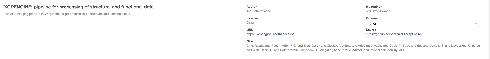
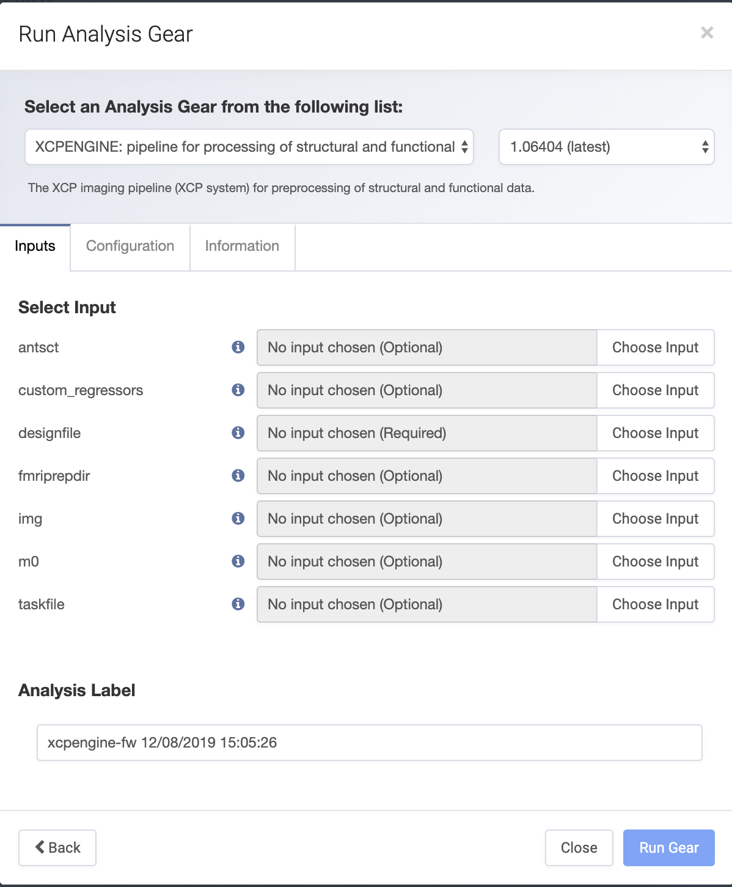
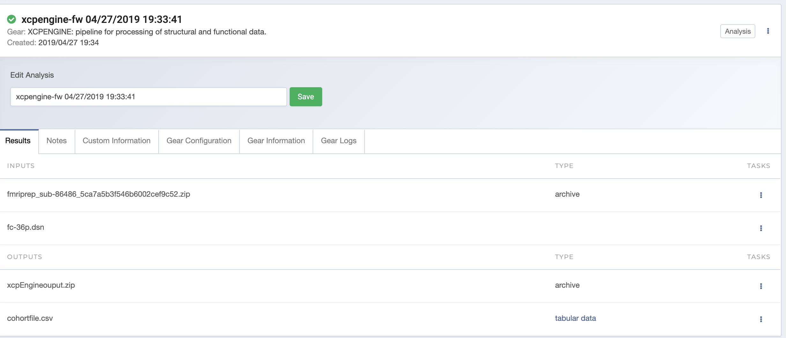

xcpEngine on Flywheel
===================================
The xcpEngine can be run on `flywheel <https://upenn.flywheel.io>`_. The procedure is the same is as runnning it on computers/clusters. 

    
    xcpEngine on Flywheel

The `design file <https://xcpengine.readthedocs.io/config/design.html>`_ is compulsory for any analysis. 
Preprocessing of BOLD data requires prior preprocessing with `FMRIPREP`. The FMRIPREP output directory need to be supplied 
as shown below. 

    
    xcpEngine input layout  on Flywheel

The cohort file will be created base on the FMRIPREP output. The `img` is input  directory for CBF. The processing of CBF requires the 
anatomical preprocessing from FRMIPREP. The  `m0` is the M0 directory for CBF calibration if present. The `struct` is the directory for 
T1w image for structural  preprocessing. 

After successful run, the `xcpEngine` zips the results and cohort file to analyses directory of the subject as shown below.

    
    xcpEngine output layout  on Flywheel