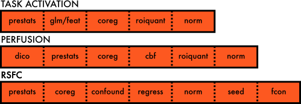

====================
XCP Imaging Pipeline
====================

The XCP imaging pipeline (XCP system) is a free, open-source software package for processing of
multimodal neuroimages. The XCP system uses a [modular design](%%BASEURL/modules/index.html) to
deploy analytic routines from leading MRI analysis platforms, including FSL, AFNI, and ANTs.

The XCP system is designed to run in the Linux bash shell or from a Docker or Singularity image. We
strongly recommend using Docker or Singularity. Users provide XCP Engine with the output from
``FMRIPREP`` and specify parameters for the analysis that they wish to perform. XCP Engine parses
the user-provided parameters to build and run a processing pipeline. The XCP system supports a
number of pipeline modalities, including functional_ connectivity, volumetric anatomical_ analysis.

Useful Features
----------------

XCP Engine provides tools to take ``FMRIPREP`` output and perform the next steps required for many
functional connectivity and structural analyses.

Neuroimage processing
---------------------

.. figure:: _static/tsRawToProcessed.png
    :scale: 100%
    :align: center

    Raw to processed time series

Neuroimage processing refers collectively to the set of strategies used to convert the "raw" images
collected from the scanner into appropriate inputs to group-level statistical analyses. The results
of any group-level neuroimaging analysis will be sensitive to the combination of strategies used to
process the subject-level images. Reproducibility of processing strategies is therefore critical.

MRI time series collected from the scanner are typically noisy. *Processing* mitigates the effect
of artefact and moves all subject-specific images into a common atlas space to facilitate direct
voxelwise comparison.

It encompasses denoising, filtering, registration, and production of any subject-level derivative
maps (for instance, seed-based connectivity maps or task contrasts). Processing includes production
of summary measures on both a voxelwise and ROI-wise basis. Notably, processing does not include
group-level statistical analysis.

Processing pipelines
--------------------

The XCP system was designed with the importance of scientific reproducibility in mind. Often,
research groups process neuroimages using a dedicated, standalone "pipeline" for each image
modality. For instance, task activation, perfusion, and functional connectivity analyses might each
be processed by a separate script.

   A standard, non-modular approach to developing pipelines with shared routines.

However, this approach can easily lead to inconsistencies in output directory conventions,
difficulty tracking pipeline versions, and limited flexibility in updating pipelines, all of which
ultimately combine to compound reproducibility challenges. Often, many common routines are deployed
across multiple MRI modalities, and it is in the interest of the investigator to minimize
redundancy and maximize reproducibility.

.. figure:: _static/choosingModules.gif
    :scale: 100%
    :align: center

    In the XCP system, select the modules that you want to use and combine them into the pipeline
    that best suits your processing needs.

The modular, atomic design of the XCP system allows for streamlined reproduction and recombination
of frequently used image processing strategies across multiple pipelines and modalities.

Features
--------

The XCP system aims to provide a multimodal library of common processing routines that will improve
scientific reproducibility. Features include:

 * Standardized output directory structure and naming conventions
 * Systematized quality control variables computed and collated for each analysis
   (for easy identification of motion and registration outliers)
 * Region-wise quantification of any voxelwise derivative map for any number of parcellation
   schemes or regions of interest
 * Easy addition of new regions of interest, node systems, or parcellation schemes
 * *Ad hoc* generation of spherical ROI maps and node systems
 * Analyses either in standard/atlas or subject/native space
 * Registration of images of any modality to a common template

.. figure:: _static/directoryStructure.png
    :scale: 100%
    :align: center

    Standardized directory structure
