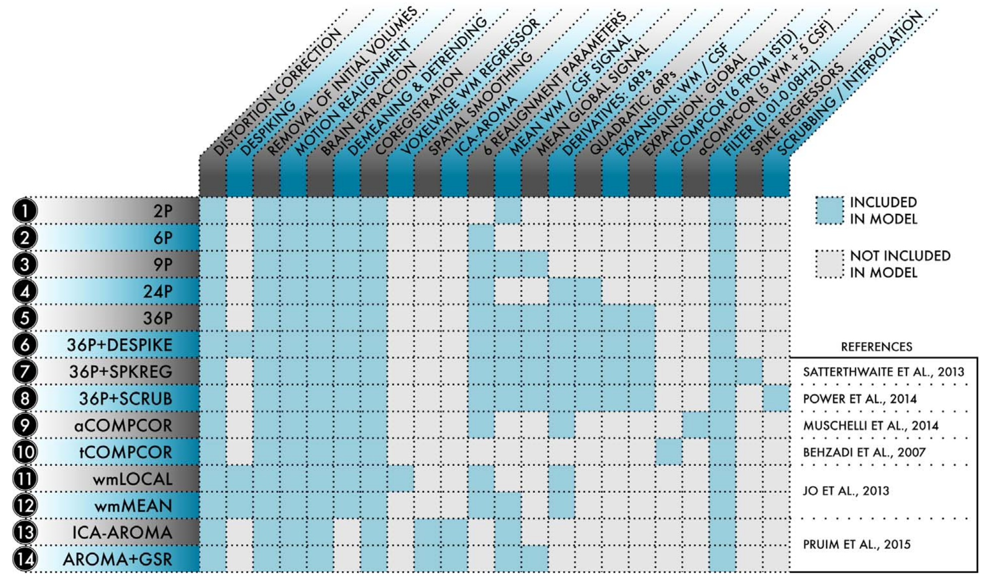

.. include:: links.rst

=========
Overview
=========

Functional connectivity can be a powerful approach to studying the brain, but must be used
carefully. Numerous artifacts can affect the quality of your results. Our approach is to
first preprocess fMRI data using ``FMRIPREP`` to quantify head motion and other confounds,
then to use these estimates in ``xcpEngine`` to *denoise* the fMRI signal and estimate
functional connectivity.

To process your data from scanner to analysis, the steps are generally

  1. Convert data from DICOMS to a BIDS_-compliant format
  2. Run ``FMRIPREP`` on the BIDS-compliant data set (fmriprep_)
  3. Run ``xcpEngine`` to estimate some of many possible measures

Steps 1 and 2 are well-documented and have active developers who can help you through these steps;
this documentation will help you get started with step 3 (``xcpEngine``).

Getting started on your personal computer
------------------------------------------

The easiest way to use xcpEngine on your laptop or personal computer is to install Docker_ and
the ``xcpEngine`` python wrapper. Ensure that Docker_ has access to at least 8GB of memory. Then
you can install the Python wrapper using::

  pip install xcpengine-container

Once this completes you can run ``xcpEngine`` without explicitly running Docker_::

  xcpengine-docker \
    -d /xcpEngine/designs/fc-36p.dsn \
    -c /path/to/cohort.csv \
    -r /path/to/data/directory \
    -i /path/to/workingdir \
    -o /path/to/outputdir

Continue reading

Getting started on a HPC system
----------------------------------

Once your data is processed by ``FMRIPREP`` you are ready to use ``xcpEngine``. ``FMRIPREP``
can write preprocessed data out in multiple spaces. At the moment, ``xcpEngine`` only supports
volume data, meaning that ``T1w`` and ``MNI152NLin2009cAsym`` are the only usable options
for ``FMRIPREP``'s ``--output-spaces`` flag. Either is a viable starting point. Choosing
``MNI152NLin2009cAsym`` is the most straightforward route, but ``T1w`` adds the possibility
of using a custom template for normalization. Here we'll assume you want to process data that
has already been resampled in MNI space (i.e. ``--output-spaces MNI152NLin2009cAsym`` was
part of your ``FMRIPREP`` call) and you're running on an HPC cluster with Singularity_
installed.

Step 1: Build a Singularity_ image
~~~~~~~~~~~~~~~~~~~~~~~~~~~~~~~~~~~~

Detailed instructions can be found in the :ref:`containers` section. Essentially you just need to
run::

  singularity build xcpEngine-latest.simg docker://pennbbl/xcpengine:latest

Step 2: Create a *cohort file*
~~~~~~~~~~~~~~~~~~~~~~~~~~~~~~~~~

``xcpEngine`` reads images and metadata from a user-provided csv file called a :ref:`cohortfile`.
Briefly, the cohort file should contain
subject metadata (without special shell characters) in ``id`` columns and paths to images
written by ``FMRIPREP`` in the ``img`` column. In this example use case, the cohort file
might be saved as ``/home/me/cohort.csv`` and contain::

  id0,img
  sub-01,sub-01/func/sub-01_task-mixedgamblestask_run-01_space-MNI152NLin2009cAsym_desc-preproc_bold.nii.gz

Step 3: Choose/Configure a Pipeline *design*
~~~~~~~~~~~~~~~~~~~~~~~~~~~~~~~~~~~~~~~~~~~~~~~~~~~~

Not functional connectivity pipelines are equally effective at addressing systematic noise
and artifacts. Many papers have proposed different denoising strategies, which may vary in
effectiveness.   ``xcpEngine`` has many of the top performing de-noising strategies implemented
available as :ref:`designfile` that can specify the processing stages and calculation of output
measures.

A library of pipelines comes pre-packaged with ``xcpEngine`` and are
described in the accompanying paper. We test these design files before distributing ``xcpengine``
and recommend using them *as-is*. Changes may produce poor-quality results.

These are pre-packaged in the Singularity_ image in ``/xcpEngine/designs`` and a full list
can be found in the GitHub repository (https://github.com/PennBBL/xcpEngine/tree/master/designs).
These designs implement the processing pipelines found in the following table:

    Available pipeline designs

.. note:: The poor-performance pipelines are not included. Also, you will need to adjust the
   thresholds for rmss for your TR (:ref:`censoring`) if you're using a pre-packaged design file.

Step 4: Process your data
~~~~~~~~~~~~~~~~~~~~~~~~~~~~~

Use Singularity_ to run the ``xcpEngine`` container you created in step 1. With some directory
binding, you are ready to run the pipeline::

  singularity run \
    -B /home/me:/mnt \
    /home/me/xcpEngine-latest.simg \
    -c /mnt/cohort.csv \
    -d /xcpEngine/designs/fc-36p.dsn \
    -i /mnt/work \
    -o /mnt/xcpOutput

__ note::
  With directory binding, ``/home/me`` is seen as ``/mnt`` from within the container. See
  containers_ for more info.

Your outputs will be located on your computer in ``/home/me/xcpOutput`` and are ready for testing
hypotheses!
